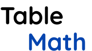

<h1 align="center">
    
</h1>

## 💻 Projeto

O TableMath é um projeto que visa facilitar o acesso a tabuada para crianças. Elas não precisam utilizar o recurso de papel, basta utilizar seu próprio smartphone para estudar a tabuada.

## :rocket: Tecnologias:
Esse projeto foi desenvolvido com as seguintes tecnologias:

- [React](https://reactjs.org)

## 🔖 Layout:

Nesse link [FIGMA](https://www.figma.com/file/G4OpmgMfTIzJ3KrOZCke1S/Table-Math?node-id=0%3A1) você pode acessar o layout do projeto.

Em breve mais informações vão ser adicionadas…